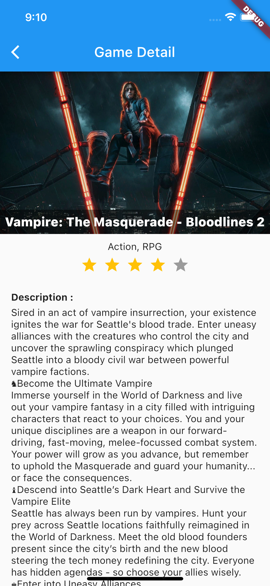

# ps5_dicky_iskandar_z

Playstastion 5 Games List

## Getting Started

This project is a simple Flutter Application to display list of Playstation 5 Games that released within a year using RAWG Api. It shows released date start form one year before until today.

# How to run :
- Clone this project
- Get your own RAWG Api key (To get your own request limit) : https://rawg.io/apidocs
- Replace current API key in **lib/app/constants/constants.dart** as ***rawgApiKey*** variable with yours.
- run main.dart

# Preview :





# Tech Stack
- Flutter
- Dart
- Flutter BloC State Management : https://pub.dev/packages/flutter_bloc
- Get It (Dependency Injection) : https://pub.dev/packages/get_it
- Dio (Http Client) https://pub.dev/packages/dio

# Pattern
- BloC Pattern

# Project Tree

```
.
├── app
│   ├── base
│   │   └── base_repository.dart
│   ├── blocs
│   │   ├── detail
│   │   │   ├── detail_bloc.dart
│   │   │   ├── detail_event.dart
│   │   │   └── detail_state.dart
│   │   └── main
│   │       ├── main_bloc.dart
│   │       ├── main_event.dart
│   │       └── main_state.dart
│   ├── constants
│   │   └── constants.dart
│   ├── data
│   │   └── api
│   │       └── rawg_api.dart
│   ├── models
│   │   ├── game_detail_response.dart
│   │   ├── game_screen_shot_response.dart
│   │   └── games_response.dart
│   ├── pages
│   │   ├── detail_page.dart
│   │   ├── image_preview_page.dart
│   │   └── main_page.dart
│   └── repositories
│       └── games_repository.dart
├── core
│   ├── completion.dart
│   └── network
│       └── http.dart
├── main.dart
├── setup_dependency_injection.dart
└── utils
    ├── collection_util.dart
    ├── connection_util.dart
    ├── date_util.dart
    └── logger_util.dart
```